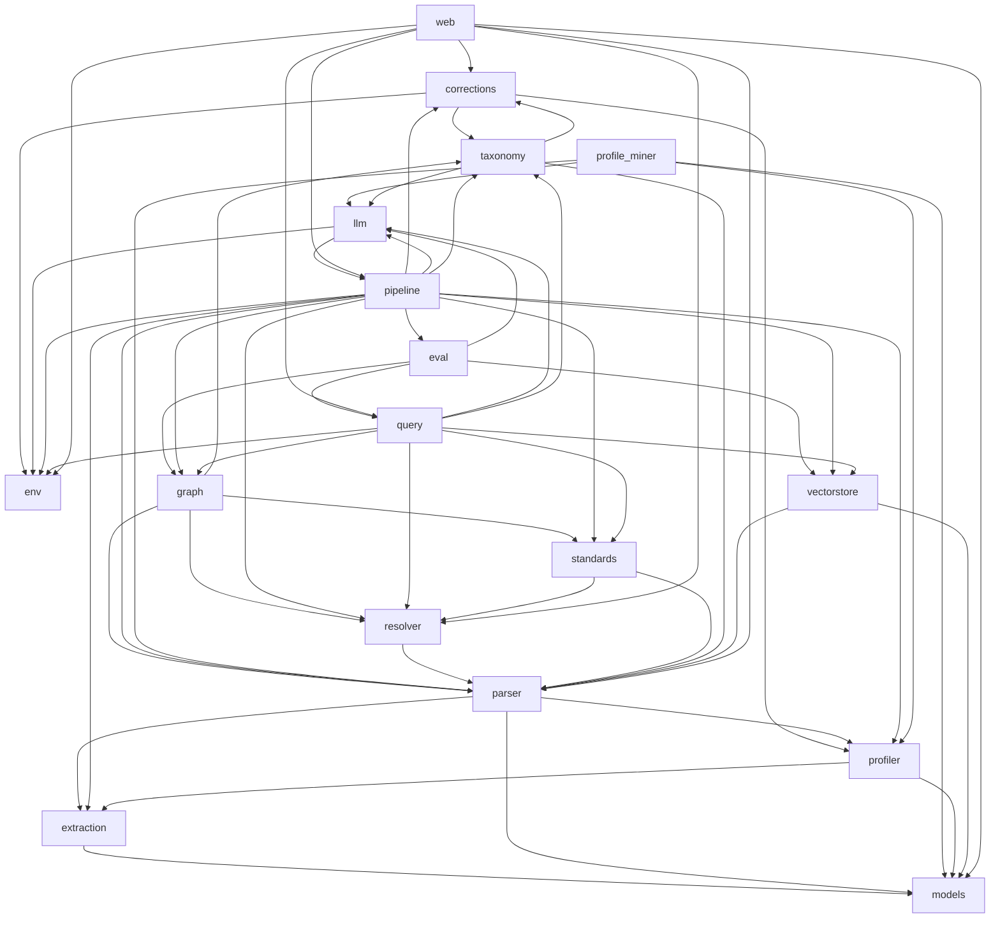

# MAP

Generated 2026-07-18 by regen-map. Do not hand-edit.

## Modules

| Module | Purpose |
| --- | --- |
| [corrections](../../core/src/corrections/MODULE.md) | Per-environment profile + taxonomy correction handling: store engineer-edited overrides, diff them against pipeline output, and emit compact FIX reports (no proprietary content) that are pasteable back into chat. |
| [env](../../core/src/env/MODULE.md) | Per-environment scoped workspace configuration. |
| [eval](../../core/src/eval/MODULE.md) | Evaluation framework for the query pipeline. |
| [extraction](../../core/src/extraction/MODULE.md) | Format-aware content extraction. |
| [graph](../../core/src/graph/MODULE.md) | Unified Knowledge Graph construction (TDD §5.8, D-002). |
| [llm](../../core/src/llm/MODULE.md) | LLM abstraction layer. |
| [models](../../core/src/models/MODULE.md) | Shared document intermediate representation. |
| [parser](../../core/src/parser/MODULE.md) | Generic, profile-driven structural parser. |
| [pipeline](../../core/src/pipeline/MODULE.md) | Staged, re-runnable pipeline that drives the nine-stage offline flow: `extract → profile → parse → resolve → taxonomy → standards → graph → vectorstore → eval`. |
| [profile_miner](../../core/src/profile_miner/MODULE.md) | Convert human-supplied parse corrections (from the Web UI Review tab) into proposed `DocumentProfile` regex patches. |
| [profiler](../../core/src/profiler/MODULE.md) | Standalone, LLM-free document-structure profiler. |
| [query](../../core/src/query/MODULE.md) | Online query pipeline (TDD §7). |
| [resolver](../../core/src/resolver/MODULE.md) | Deterministic cross-reference resolver (TDD §5.5, Methods 1 & 2). |
| [standards](../../core/src/standards/MODULE.md) | 3GPP standards ingestion — generic, release-aware, LLM-free (TDD §5.6, D-004). |
| [taxonomy](../../core/src/taxonomy/MODULE.md) | Bottom-up, LLM-derived feature taxonomy for the corpus (TDD §5.7). |
| [vectorstore](../../core/src/vectorstore/MODULE.md) | Unified vector-store construction and configuration. |
| [web](../../core/src/web/MODULE.md) | FastAPI + Bootstrap 5 + HTMX Web UI for non-CLI team members (D-008). |

## Dependency graph



## Project File Structure

_Alphabetical, regenerated by regen-map. Directory descriptions come from MODULE.md Purpose; file descriptions come from the per-language description-source rule in structure-conventions.md._

```
nora/
├── CLAUDE.md
├── CONTRIBUTING.md
├── README.md
├── SETUP_OFFLINE.md
├── TDD_Telecom_Requirements_AI_System.md
├── cline-playbooks/
│   ├── README.md
│   ├── annotation-schema.md
│   ├── bootstrap.md
│   ├── debug-pipeline.md
│   ├── derive-prompts.md
│   ├── derive-rule.md
│   ├── feedback-loop.md
│   ├── mapping.md
│   ├── orient.md
│   ├── profile-corpus.md
│   └── share-back.md
├── config/
│   ├── env.json
│   ├── llm.json
│   ├── retrieval.json
│   └── web.json
├── core/
│   ├── __init__.py
│   ├── src/
│   │   ├── __init__.py
│   │   ├── corrections/                               # Per-environment profile + taxonomy correction handling: store engineer-edited overrides, diff them against pipeline output, and emit compact FIX reports (no proprietary content) that are pasteable back into chat.
│   │   │   ├── MODULE.md
│   │   │   ├── __init__.py                            # Corrections module — profile + taxonomy editing, diff, and compact FIX reports.
│   │   │   ├── compactor.py                           # Compact FIX report generators for profile and taxonomy corrections.
│   │   │   ├── schema.py                              # Data models for correction FIX reports.
│   │   │   └── store.py                               # CorrectionStore — per-environment correction file management.
│   │   ├── env/                                       # Per-environment scoped workspace configuration.
│   │   │   ├── MODULE.md
│   │   │   ├── __init__.py
│   │   │   ├── config.py                              # Environment configuration for multi-user pipeline workflows.
│   │   │   ├── env_cli.py                             # CLI for environment management.
│   │   │   └── profile_bindings.py                    # Per-cell profile binding (D-DRAFT-7).
│   │   ├── eval/                                      # Evaluation framework for the query pipeline.
│   │   │   ├── MODULE.md
│   │   │   ├── __init__.py
│   │   │   ├── eval_cli.py                            # CLI for the evaluation framework (PoC Step 11).
│   │   │   ├── metrics.py                             # Evaluation metrics for the query pipeline (TDD 9.4).
│   │   │   ├── questions.py                           # Evaluation test question set with ground truth (TDD 9.4).
│   │   │   └── runner.py                              # Evaluation runner (TDD 9.4, Step 11).
│   │   ├── extraction/                                # Format-aware content extraction.
│   │   │   ├── MODULE.md
│   │   │   ├── __init__.py
│   │   │   ├── base.py                                # Base extractor interface for all format-specific extractors.
│   │   │   ├── docling_provider.py                    # DoclingProvider — tables + figures via Docling (IBM), behind LayoutProvider.
│   │   │   ├── docx_extractor.py                      # DOCX content extractor using python-docx.
│   │   │   ├── extract.py                             # CLI entry point for document content extraction.
│   │   │   ├── layout_provider.py                     # LayoutProvider — pluggable source of table + figure structure for extraction.
│   │   │   ├── pdf_extractor.py                       # PDF content extractor using pymupdf (text + images) and pdfplumber (tables).
│   │   │   ├── registry.py                            # Extractor registry — maps file extensions to format-specific extractors.
│   │   │   ├── release_key.py                         # MMMYYYY release-label convention — parse, validate, order.
│   │   │   └── xlsx_extractor.py                      # XLSX content extractor using openpyxl.
│   │   ├── graph/                                     # Unified Knowledge Graph construction (TDD §5.8, D-002).
│   │   │   ├── MODULE.md
│   │   │   ├── __init__.py
│   │   │   ├── builder.py                             # Knowledge Graph builder (TDD 5.8).
│   │   │   ├── graph_cli.py                           # CLI entry point for Knowledge Graph construction (TDD 5.8).
│   │   │   └── schema.py                              # Knowledge Graph schema definitions (TDD 6.1–6.2).
│   │   ├── llm/                                       # LLM abstraction layer.
│   │   │   ├── MODULE.md
│   │   │   ├── __init__.py
│   │   │   ├── base.py                                # LLM provider abstraction layer.
│   │   │   ├── llm_debug.py                           # LLM debug — verify the active LLM provider and probe arbitrary endpoints.
│   │   │   ├── mock_provider.py                       # Mock LLM provider for testing without API keys.
│   │   │   ├── model_picker.py                        # Hardware detection and LLM model selection.
│   │   │   ├── ollama_provider.py                     # Ollama LLM provider for local model inference.
│   │   │   └── openai_provider.py                     # OpenAI-compatible LLM provider for cloud APIs.
│   │   ├── models/                                    # Shared document intermediate representation.
│   │   │   ├── MODULE.md
│   │   │   ├── __init__.py
│   │   │   └── document.py                            # Normalized intermediate representation for extracted documents.
│   │   ├── parser/                                    # Generic, profile-driven structural parser.
│   │   │   ├── MODULE.md
│   │   │   ├── __init__.py
│   │   │   ├── parse_audit.py                         # Per-document parse audit — confidence scoring + correction template.
│   │   │   ├── parse_cli.py                           # CLI entry point for the generic structural parser.
│   │   │   ├── parse_debug.py                         # parse_debug — diagnostic CLI for parser-side detection paths.
│   │   │   ├── parse_log.py                           # Per-document parse transparency log.
│   │   │   ├── parse_review.py                        # Parse-log review format and compact report generator.
│   │   │   ├── parse_review_cli.py                    # CLI for parse-log review: generate templates and compact chat reports.
│   │   │   ├── parse_summary.py                       # Per-doc + corpus-level parse summary — debugging companion to the
│   │   │   ├── structural_parser.py                   # Generic, profile-driven structural parser (TDD 5.3).
│   │   │   └── user_annotations.py                    # Apply user-driven `remove` annotations to a DocumentIR before parse [D-061].
│   │   ├── pipeline/                                  # Staged, re-runnable pipeline that drives the nine-stage offline flow: `extract → profile → parse → resolve → taxonomy → standards → graph → vectorstore → eval`.
│   │   │   ├── MODULE.md
│   │   │   ├── __init__.py
│   │   │   ├── cells.py                               # (MNO, release) cell primitives for the NORA pipeline (D-DRAFT-6).
│   │   │   ├── error_codes.py                         # Structured error codes for all pipeline stages.
│   │   │   ├── report.py                              # Pipeline report generation.
│   │   │   ├── run_cli.py                             # CLI entry point for the pipeline runner.
│   │   │   ├── runner.py                              # Pipeline orchestrator.
│   │   │   └── stages.py                              # Pipeline stage functions.
│   │   ├── profile_miner/                             # Convert human-supplied parse corrections (from the Web UI Review tab) into proposed `DocumentProfile` regex patches.
│   │   │   ├── MODULE.md
│   │   │   ├── __init__.py                            # Mine document-profile regex patterns from human corrections.
│   │   │   ├── apply_patch.py                         # Apply a ``ProfilePatch`` (output of ``mine_patterns``) to the
│   │   │   ├── apply_profile_patch_cli.py             # CLI: apply ``profile_patch_<doc>.json`` files onto
│   │   │   ├── loader.py                              # Load corrections from ``<env_dir>/corrections/`` and join each entry
│   │   │   ├── miner.py                               # Cluster enriched corrections by ``expected_reason`` and ask an LLM
│   │   │   ├── profile_miner_cli.py                   # CLI entrypoint for the profile-miner.
│   │   │   ├── records.py                             # Dataclasses passed between profile_miner sub-modules.
│   │   │   └── redaction.py                           # Redact proprietary tokens before sending text to the LLM and restore
│   │   ├── profiler/                                  # Standalone, LLM-free document-structure profiler.
│   │   │   ├── ANNOTATIONS.md
│   │   │   ├── MODULE.md
│   │   │   ├── __init__.py
│   │   │   ├── profile_cli.py                         # CLI entry point for the DocumentProfiler.
│   │   │   ├── profile_debug.py                       # Profile debug — inspect / bootstrap / validate document profiles.
│   │   │   ├── profile_schema.py                      # Document structure profile schema (TDD 5.2.3).
│   │   │   ├── profile_substitute.py                  # Profile placeholder substitution [D-062].
│   │   │   └── profiler.py                            # DocumentProfiler — standalone, LLM-free document structure analysis.
│   │   ├── query/                                     # Online query pipeline (TDD §7).
│   │   │   ├── MODULE.md
│   │   │   ├── RETRIEVAL.md
│   │   │   ├── __init__.py
│   │   │   ├── analyzer.py                            # Query analyzer (TDD 7.1).
│   │   │   ├── bm25_index.py                          # BM25 sparse retrieval index for the query pipeline.
│   │   │   ├── citation_audit.py                      # Citation audit (Stage 6.5).
│   │   │   ├── context_builder.py                     # Context assembler (TDD 7.5).
│   │   │   ├── graph_scope.py                         # Graph scoper (TDD 7.3).
│   │   │   ├── grouping.py                            # Hierarchy-based chunk grouping (Stage 4.7).
│   │   │   ├── pipeline.py                            # Query pipeline orchestrator (TDD 7).
│   │   │   ├── query_cli.py                           # CLI for the query pipeline (PoC Step 10).
│   │   │   ├── rag_retriever.py                       # Targeted vector RAG retriever (TDD 7.4).
│   │   │   ├── reranker.py                            # Cross-encoder reranker — final-pass relevance scoring on the
│   │   │   ├── resolver.py                            # MNO and release resolver (TDD 7.2).
│   │   │   ├── retrieval_debug.py                     # Retrieval debug — pinpoint why retrieval behaves differently across
│   │   │   ├── rewriter.py                            # Query rewriting / expansion (TDD §7 — pre-retrieval enrichment).
│   │   │   ├── schema.py                              # Query pipeline data models (TDD 7.1-7.6).
│   │   │   └── synthesizer.py                         # LLM synthesizer (TDD 7.6).
│   │   ├── resolver/                                  # Deterministic cross-reference resolver (TDD §5.5, Methods 1 & 2).
│   │   │   ├── MODULE.md
│   │   │   ├── __init__.py
│   │   │   ├── resolve_cli.py                         # CLI entry point for cross-reference resolution.
│   │   │   ├── resolve_review.py                      # Resolve-review: template generation and compact RES-CHK report.
│   │   │   ├── resolve_review_cli.py                  # CLI for resolve-log review: generate templates and compact chat reports.
│   │   │   └── resolver.py                            # Cross-reference resolver (TDD 5.5, Methods 1 & 2).
│   │   ├── standards/                                 # 3GPP standards ingestion — generic, release-aware, LLM-free (TDD §5.6, D-004).
│   │   │   ├── MODULE.md
│   │   │   ├── __init__.py
│   │   │   ├── hf_source.py                           # HuggingFace `GSMA/3GPP` dataset as a 3GPP spec source.
│   │   │   ├── reference_collector.py                 # Standards reference collector (TDD 5.6, Step 1).
│   │   │   ├── schema.py                              # Data models for standards ingestion (TDD 5.6).
│   │   │   ├── section_extractor.py                   # Selective section extraction from parsed 3GPP specs (TDD 5.6, Step 2).
│   │   │   ├── spec_downloader.py                     # 3GPP spec downloader with local caching and pluggable source.
│   │   │   ├── spec_parser.py                         # 3GPP specification document parser (DOC/DOCX to section tree).
│   │   │   ├── spec_resolver.py                       # 3GPP spec version resolver and URL builder.
│   │   │   └── standards_cli.py                       # CLI entry point for standards ingestion pipeline.
│   │   ├── taxonomy/                                  # Bottom-up, LLM-derived feature taxonomy for the corpus (TDD §5.7).
│   │   │   ├── MODULE.md
│   │   │   ├── __init__.py
│   │   │   ├── consolidator.py                        # Feature taxonomy consolidation (TDD 5.7, Step 2 — single MNO).
│   │   │   ├── extractor.py                           # Document-level feature extraction (TDD 5.7, Step 1).
│   │   │   ├── schema.py                              # Feature taxonomy data model (TDD 5.7).
│   │   │   └── taxonomy_cli.py                        # CLI entry point for feature taxonomy extraction and consolidation.
│   │   ├── vectorstore/                               # Unified vector-store construction and configuration.
│   │   │   ├── MODULE.md
│   │   │   ├── __init__.py                            # Vector store module — embedding + storage Protocols + provider factory.
│   │   │   ├── builder.py                             # Vector store builder (TDD 5.9).
│   │   │   ├── cell_loader.py                         # Load per-cell vector stores from a vectorstore root (D-DRAFT-11).
│   │   │   ├── chunk_builder.py                       # Chunk builder for contextualized requirement chunks (TDD 5.9).
│   │   │   ├── config.py                              # Vector store configuration.
│   │   │   ├── embed_debug.py                         # Embed debug — verify the embedding provider standalone, find failing chunks.
│   │   │   ├── embedding_base.py                      # Embedding provider abstraction layer.
│   │   │   ├── embedding_ollama.py                    # Ollama embedding provider for local model inference.
│   │   │   ├── embedding_st.py                        # Sentence-transformers embedding provider.
│   │   │   ├── embedding_tei.py                       # TEI embedding provider — HuggingFace Text Embeddings Inference.
│   │   │   ├── hf_offline.py                          # Enable HuggingFace Hub offline mode when the model is already cached.
│   │   │   ├── probe_tei.py                           # Probe a TEI deployment's embedding + reranking wire shapes.
│   │   │   ├── store_base.py                          # Vector store abstraction layer.
│   │   │   ├── store_chroma.py                        # ChromaDB vector store backend.
│   │   │   └── vectorstore_cli.py                     # CLI for vector store construction (PoC Step 9).
│   │   └── web/                                       # FastAPI + Bootstrap 5 + HTMX Web UI for non-CLI team members (D-008).
│   │       ├── MODULE.md
│   │       ├── __init__.py
│   │       ├── app.py                                 # NORA Web UI — FastAPI application.
│   │       ├── config.py                              # Web UI configuration.
│   │       ├── config_db.py                           # SQLite-backed config store for the web Config page.
│   │       ├── config_schema.py                       # Schema describing the Config page's editable knobs.
│   │       ├── feedback_db.py                         # Test-page feedback store — async SQLite log of question / answer /
│   │       ├── jobs.py                                # Job queue for NORA pipeline execution tracking.
│   │       ├── markdown_render.py                     # Markdown → HTML rendering for LLM-synthesized answers.
│   │       ├── metrics.py                             # Metrics persistence store for NORA observability.
│   │       ├── middleware.py                          # Request timing middleware for NORA Web UI.
│   │       ├── path_mapper.py                         # Path translation between Windows UNC paths and Linux mount points.
│   │       ├── resource_sampler.py                    # Background resource sampler for NORA observability.
│   │       ├── routes/
│   │       │   ├── __init__.py                        # Web UI route packages.
│   │       │   ├── config_route.py                    # Config page — read/edit configurable knobs persisted to the
│   │       │   ├── corrections.py                     # Corrections routes — profile + taxonomy editors and compact FIX reports.
│   │       │   ├── dashboard.py                       # Dashboard page and API routes.
│   │       │   ├── environments.py                    # Environments page and API routes.
│   │       │   ├── files.py                           # File browser page and routes.
│   │       │   ├── jobs.py                            # Jobs routes -- listing, detail, SSE log streaming, cancel.
│   │       │   ├── metrics_route.py                   # Metrics page and API routes.
│   │       │   ├── parse_review.py                    # Parse routes — Summary landing + per-doc Review.
│   │       │   ├── pipeline.py                        # Pipeline page and API routes.
│   │       │   ├── playground.py                      # Test page — multi-section playground for free-form requirement
│   │       │   ├── query.py                           # Query page and API routes.
│   │       │   ├── req_browser.py                     # Requirement browser routes — browse, view, and compare requirements.
│   │       │   └── resolve_review.py                  # Resolve-review routes — table-based cross-reference resolution review UI.
│   │       ├── static/
│   │       │   ├── css/
│   │       │   │   └── style.css
│   │       │   ├── js/
│   │       │   │   ├── app.js
│   │       │   │   ├── parse_review.js
│   │       │   │   ├── req_browser.js
│   │       │   │   └── resolve_review.js
│   │       │   └── vendor/
│   │       │       ├── bootstrap-icons/
│   │       │       │   ├── bootstrap-icons.min.css
│   │       │       │   └── fonts/
│   │       │       │       ├── bootstrap-icons.woff
│   │       │       │       └── bootstrap-icons.woff2
│   │       │       ├── bootstrap/
│   │       │       │   ├── bootstrap.bundle.min.js
│   │       │       │   └── bootstrap.min.css
│   │       │       └── htmx/
│   │       │           └── htmx.min.js
│   │       ├── team_mode.py                           # Team-eval access gating (team-eval-pilot).
│   │       └── templates/
│   │           ├── _config_save_ack.html
│   │           ├── base.html
│   │           ├── config.html
│   │           ├── corrections/
│   │           │   ├── index.html
│   │           │   ├── profile.html
│   │           │   ├── report.html
│   │           │   └── taxonomy.html
│   │           ├── dashboard.html
│   │           ├── environment_new.html
│   │           ├── environments.html
│   │           ├── files.html
│   │           ├── job_detail.html
│   │           ├── jobs.html
│   │           ├── metrics.html
│   │           ├── parse_review/
│   │           │   ├── _report.html
│   │           │   ├── _view.html
│   │           │   └── index.html
│   │           ├── partials/
│   │           │   ├── dashboard_jobs.html
│   │           │   ├── dashboard_status.html
│   │           │   ├── file_listing.html
│   │           │   ├── jobs_table.html
│   │           │   ├── metrics_resource.html
│   │           │   └── query_result.html
│   │           ├── pipeline.html
│   │           ├── query.html
│   │           ├── req_browser/
│   │           │   ├── _compare.html
│   │           │   ├── _req_detail.html
│   │           │   ├── _tree.html
│   │           │   └── index.html
│   │           ├── resolve_review/
│   │           │   ├── _report.html
│   │           │   ├── _view.html
│   │           │   └── index.html
│   │           └── test/
│   │               ├── _answer.html
│   │               ├── _feedback_ack.html
│   │               ├── _feedback_legacy.html
│   │               ├── _feedback_merged.html
│   │               ├── _ingested.html
│   │               ├── _merged_answer.html
│   │               └── index.html
│   └── tests/
│       ├── __init__.py
│       ├── test_apply_profile_patch.py                # Tests for the profile_patch → corrections-profile merger.
│       ├── test_bm25_index.py                         # Unit tests for BM25 sparse retrieval (`bm25_index.py`).
│       ├── test_chunk_builder_chunk_role.py           # Tests for chunk_role classification and parent-body prepending.
│       ├── test_chunk_builder_context.py              # Tests for ancestor-section Context in chunk text (D-DRAFT-5, strand
│       ├── test_chunk_builder_definitions.py          # Tests for FR-35 [D-032] inline definition expansion in chunk_builder.
│       ├── test_chunk_builder_hierarchy.py            # Tests for hierarchy path prefixing in chunk text and metadata.
│       ├── test_chunk_builder_subsections.py          # Tests for parent-chunk augmentation with child titles.
│       ├── test_document_ir.py                        # Tests for DocumentIR serialize/deserialize round-trip.
│       ├── test_docx_extractor_merges.py              # Tests for the DOCX extractor's merged-cell metadata.
│       ├── test_embedding_ollama.py                   # Tests for OllamaEmbedder + make_embedder factory.
│       ├── test_embedding_tei.py                      # Tests for TEIEmbedder + make_embedder factory wiring.
│       ├── test_env_config.py                         # Tests for `EnvironmentConfig` path helpers — focused on `~` expansion.
│       ├── test_eval.py                               # Tests for the evaluation framework (Step 11).
│       ├── test_extractor_images_root.py              # images_root redirect — extracted-image artifacts belong in the BUILD
│       ├── test_feedback_db.py                        # Tests for `core/src/web/feedback_db.py` — Test page Q&A + vote log.
│       ├── test_glossary_skip_from_rag.py             # Tests for Phase 5 of the generic-rules pivot — skip glossary from RAG.
│       ├── test_graph.py                              # Tests for the Knowledge Graph construction (Step 8).
│       ├── test_hf_source.py                          # Tests for HuggingFaceSource — fully mocked, no network.
│       ├── test_integration_oa_corpus.py              # Integration test: extract → profile → parse against the 5 Verizon OA PDFs.
│       ├── test_last_run_req_id.py                    # Tests for ``RequirementIdPattern.anchor`` extraction modes.
│       ├── test_layout_fusion.py                      # Extractor fusion of a LayoutProvider's tables/figures into the pymupdf text
│       ├── test_layout_provider_foundation.py         # Phase-1 foundation for the Docling/LayoutProvider integration (mno-c-ingestion).
│       ├── test_openai_provider.py                    # Tests for OpenAICompatibleProvider — fully mocked, no network.
│       ├── test_parse_audit.py                        # Tests for the per-document parse-audit tool (parse_audit.py).
│       ├── test_parse_log.py                          # Tests for ParseLog generation: dropped block recording, range merging,
│       ├── test_parse_review.py                       # Tests for parse_review: template generation and compact report format.
│       ├── test_parse_review_section_annotations.py   # Tests for SECTION_HEADING annotations emitted by the parse-review
│       ├── test_parse_summary.py                      # Tests for ``RequirementTree.parse_summary`` — the per-doc evidence
│       ├── test_parse_table_header_fallback.py        # Tests for the table-header fallback paths:
│       ├── test_parser_exclude_sections.py            # Profile-driven section exclusion (D-DRAFT-13).
│       ├── test_patterns.py                           # Tests for regex patterns used across extraction, profiling, and parsing.
│       ├── test_pdf_extractor_lines.py                # Tests for PDF source-line-boundary preservation (ContentBlock.lines).
│       ├── test_pdf_extractor_strike.py               # Unit tests for PDF strike-detection geometry helpers (FR-33 [D-031]).
│       ├── test_pdf_extractor_text_tables.py          # Guards for the opt-in text-strategy (borderless) table detection.
│       ├── test_pipeline.py                           # Pipeline smoke tests — extract, profile, and parse real PDFs.
│       ├── test_pipeline_cells.py                     # Tests for the pipeline (MNO, release) cell substrate (D-DRAFT-6).
│       ├── test_plan_metadata.py                      # Tests for plan-metadata extraction (`_extract_plan_metadata`).
│       ├── test_playground_helpers.py                 # Tests for the merged-tab helpers in core/src/web/routes/playground.py:
│       ├── test_profile_bindings.py                   # Tests for per-cell profile binding (D-DRAFT-7).
│       ├── test_profile_miner.py                      # Tests for the profile_miner module.
│       ├── test_profile_schema.py                     # Tests for DocumentProfile serialize/deserialize round-trip.
│       ├── test_profile_substitute.py                 # Tests for profile placeholder substitution [D-062].
│       ├── test_query.py                              # Tests for the query pipeline (PoC Step 10).
│       ├── test_query_cell_routing.py                 # Query-side cell routing (D-DRAFT-11 slice 2).
│       ├── test_query_citation_audit.py               # Tests for Stage 6.5 — per-sentence citation audit.
│       ├── test_query_grouping.py                     # Tests for hierarchy-based chunk grouping (Stage 4.7).
│       ├── test_query_grouping_pipeline.py            # Tests for Stage 4.7 (hierarchy grouping) pipeline integration.
│       ├── test_query_intent.py                       # Tests for Step 4 — FACT and SUMMARIZE intent classification + routing.
│       ├── test_query_reranker.py                     # Tests for `core/src/query/reranker.py` — cross-encoder reranker
│       ├── test_query_rewriter.py                     # Tests for `core/src/query/rewriter.py` — pre-retrieval query expansion.
│       ├── test_query_threshold.py                    # Tests for the relevance threshold filter in QueryPipeline (Stage 4.5).
│       ├── test_reference_list.py                     # Tests for reference_list extraction [D-059, D-061].
│       ├── test_release_key.py                        # Tests for the MMMYYYY release-label convention (D-DRAFT-6).
│       ├── test_resolver.py                           # Tests for the cross-reference resolver.
│       ├── test_revhist_omission.py                   # FR-34 revision-history omission — profiler detection + parser drop.
│       ├── test_revhist_scoring.py                    # Tests for the signal-based revhist scorer (RevhistDetection).
│       ├── test_stages_per_cell.py                    # Per-cell stage routing tests (D-DRAFT-6/7/10).
│       ├── test_standards.py                          # Tests for the standards ingestion pipeline (Step 7).
│       ├── test_strike_runs.py                        # Tests for the unified strike model [D-060].
│       ├── test_structural_parser_content_start.py    # Tests for the content-start cutoff (D-DRAFT-4).
│       ├── test_structural_parser_headings.py         # Tests for the numbering-driven heading classification contract.
│       ├── test_structural_parser_inline_id.py        # Inline-trailing req_id in heading text (mno-c-ingestion).
│       ├── test_structural_parser_leading_id.py       # Tests for leading-id body-block requirement detection (D-DRAFT-2).
│       ├── test_structural_parser_table_anchors.py    # Tests for table-cell req-ID anchoring in GenericStructuralParser.
│       ├── test_taxonomy.py                           # Tests for the feature taxonomy pipeline (Step 6).
│       ├── test_team_mode.py                          # Tests for team-mode access gating (team-eval-pilot).
│       ├── test_toc_pairing.py                        # Tests for the style-driven TOC pre-pass and section-number pairing.
│       ├── test_user_annotations.py                   # Tests for user-driven `remove` annotations [D-061].
│       ├── test_vectorstore.py                        # Tests for vector store construction (PoC Step 9).
│       ├── test_vectorstore_cell.py                   # Per-cell vectorstore build + cell-store loader (D-DRAFT-11 slice 1).
│       ├── test_web_config.py                         # Tests for `core/src/web/config.py` — env_dir + DB-path resolution.
│       ├── test_web_config_db.py                      # Tests for ConfigStore + Config-page wiring.
│       ├── test_web_jobs.py                           # Tests for the NORA web job queue.
│       ├── test_web_markdown_render.py                # Tests for the web markdown renderer.
│       ├── test_web_path_mapper.py                    # Tests for the web path mapper module.
│       ├── test_web_playground.py                     # Tests for the Test-page corpus-label helper.
│       └── test_xlsx_extractor.py                     # Tests for XLSXExtractor (FR-1).
├── customizations/
│   ├── __init__.py
│   ├── llm/
│   │   ├── README.md
│   │   ├── __init__.py
│   │   ├── proprietary_provider.py                    # Proprietary LLM provider stub.
│   │   └── tests/
│   │       ├── __init__.py
│   │       └── test_proprietary_provider.py           # Smoke tests for the ProprietaryLLMProvider stub.
│   ├── mappings/
│   │   └── README.md
│   └── profiles/
│       ├── bs_5114ac92.json
│       ├── bs_cf29e619.json
│       ├── bs_d7a2c81f.json
│       └── vzw_oa_profile.json
├── docker/
│   ├── README.md
│   ├── debug-egress.sh                                # debug-egress.sh — pinpoint WHY container network egress fails on this host.
│   ├── docker-compose.yml
│   ├── env.example
│   ├── env.nora-pipeline.example
│   ├── env.nora-web.example
│   ├── env.sira-batch.example
│   ├── env.sira-query.example
│   ├── ingest.sh                                      # ingest.sh — quoting-proof launcher for containerized pipeline lane runs.
│   ├── nora.Dockerfile
│   ├── prep-offline.sh                                # prep-offline.sh — HOST-side prep for OFFLINE=1 docker builds.
│   ├── promote.sh                                     # promote.sh — snapshot the SERVE-set of a nora-build + sira-build into
│   ├── pull.sh                                        # Fetch image tarballs from an internal-GitHub release and docker-load them.
│   ├── push.sh                                        # Publish built images as Release assets on the internal GitHub repo.
│   ├── sira.Dockerfile
│   └── skopeo-pull-bases.sh                           # skopeo-pull-bases.sh — fetch the BASE images the docker/*.Dockerfile builds
├── docs/
│   └── compact/
│       ├── DECISIONS.md
│       ├── MAP.md
│       ├── PROJECT.md
│       ├── STATUS.md
│       ├── design-inputs/
│       │   ├── README.md
│       │   ├── SESSION_SUMMARY.md
│       │   ├── SETUP_OFFLINE.md
│       │   └── TDD_Telecom_Requirements_AI_System.md
│       ├── phases/
│       │   ├── architecture.md
│       │   ├── development.md
│       │   └── requirements.md
│       ├── project-init-interview.md
│       ├── requirements.md
│       ├── retrofit-snapshot.md
│       ├── strands/
│       │   ├── _archive/
│       │   │   ├── glossary-scoring/
│       │   │   │   ├── STRAND.md
│       │   │   │   ├── decisions-draft.md
│       │   │   │   └── journal.md
│       │   │   ├── mno-c-ingestion/
│       │   │   │   ├── STRAND.md
│       │   │   │   ├── asset-ingestion-design.md
│       │   │   │   ├── decisions-draft.md
│       │   │   │   ├── docling-integration-design.md
│       │   │   │   └── journal.md
│       │   │   ├── multi-mno-nora/
│       │   │   │   ├── STRAND.md
│       │   │   │   ├── decisions-draft.md
│       │   │   │   ├── journal.md
│       │   │   │   ├── mno-b-spec.md
│       │   │   │   ├── multi-mno-ingestion-design.md
│       │   │   │   └── verification-runbook.md
│       │   │   ├── multi-mno-sira/
│       │   │   │   ├── STRAND.md
│       │   │   │   ├── decisions-draft.md
│       │   │   │   ├── journal.md
│       │   │   │   └── multi-cell-runbook.md
│       │   │   ├── section-handling/
│       │   │   │   ├── STRAND.md
│       │   │   │   ├── decisions-draft.md
│       │   │   │   └── journal.md
│       │   │   └── sira/
│       │   │       ├── STRAND.md
│       │   │       ├── decisions-draft.md
│       │   │       └── journal.md
│       │   ├── docker-distro/
│       │   │   ├── STRAND.md
│       │   │   ├── decisions-draft.md
│       │   │   ├── docker-distro-design.md
│       │   │   └── journal.md
│       │   ├── image-ingestion/
│       │   │   ├── STRAND.md
│       │   │   ├── decisions-draft.md
│       │   │   └── journal.md
│       │   ├── nora-retrieval-parent-displacement/
│       │   │   ├── STRAND.md
│       │   │   ├── decisions-draft.md
│       │   │   └── journal.md
│       │   ├── nora-retrieval-quality/
│       │   │   ├── STRAND.md
│       │   │   ├── decisions-draft.md
│       │   │   └── journal.md
│       │   ├── plan-aware-sira/
│       │   │   ├── STRAND.md
│       │   │   ├── decisions-draft.md
│       │   │   └── journal.md
│       │   ├── references-handling/
│       │   │   ├── STRAND.md
│       │   │   ├── decisions-draft.md
│       │   │   └── journal.md
│       │   └── team-eval-pilot/
│       │       ├── STRAND.md
│       │       ├── decisions-draft.md
│       │       └── journal.md
│       └── structure-conventions.md
├── experiments/
│   ├── image-analysis/
│   │   ├── README.md
│   │   └── analyze_image.py                           # PoC: convert requirement-document figures to retrievable text via a
│   └── layout-bakeoff/
│       ├── README.md
│       ├── fetch_docling_models.py                    # Pre-download Docling models on a NETWORK-CONNECTED machine, to copy to a
│       ├── layout_provider.py                         # Normalized layout-parsing contract for the MNO-C table/figure bake-off.
│       ├── overlay.py                                 # Overlay a provider's detected bboxes onto the rendered PDF pages, to VERIFY
│       ├── prov_docling.py                            # Docling adapter (IBM). Library, born-digital-text-first, CPU-capable.
│       ├── prov_hiro.py                               # Hiro-Smart-Doc adapter. Hiro is a FastAPI SERVICE (not a library), so this is
│       ├── prov_paddle.py                             # PaddleOCR PP-Structure adapter. Renders each page to an image (pymupdf) and
│       ├── requirements-docling.txt
│       ├── requirements-hiro.txt
│       ├── requirements-paddle.txt
│       ├── run_bakeoff.py                             # Run ONE layout provider over one or more PDFs and write normalized outputs.
│       └── summarize.py                               # Combine all `*.json` bake-off outputs in a dir into one comparison report.
├── presentations/
│   ├── create.py                                      # Generate NORA leadership presentation.
│   └── update.py                                      # Add Human Filter philosophy to NORA presentation.
├── requirements.txt
├── sandbox/
│   ├── EVAL_PREP.md
│   ├── README.md
│   ├── SETUP.md
│   ├── activate.sh                                    # Activate the SIRA sandbox under NORA's uv-based install.
│   ├── adapter/
│   │   ├── __init__.py
│   │   ├── nora_to_beir.py                            # NORA → BEIR adapter for the SIRA standalone-sandbox experiment.
│   │   └── test_nora_to_beir.py                       # Tests for the NORA → BEIR adapter — multi-cell partitioning (multi-mno-sira).
│   ├── install_configs.sh                             # Install the NORA-specific SIRA hydra configs + prompts into the
│   ├── prompts/
│   │   ├── doc_requirement_v01.txt
│   │   ├── query_requirement_v01.txt
│   │   └── relevance_requirement_v01.txt
│   ├── run_stack.sh                                   # run_stack.sh — launch ONE isolated SIRA-service + NORA-web stack (Path-B),
│   ├── shim/
│   │   ├── __init__.py
│   │   └── openai_shim.py                             # Local shim that accepts SIRA's hardcoded
│   ├── sira_cells.py                                  # Shared (MNO, release) cell primitives for multi-MNO SIRA.
│   ├── sira_configs/
│   │   ├── data/
│   │   │   └── nora.yaml
│   │   ├── enrich/
│   │   │   └── nora.yaml
│   │   └── rerank/
│   │       └── nora.yaml
│   ├── sira_enrich_inspect.py                         # SIRA doc-enrichment inspector — print the enrichment data for one req_id.
│   ├── sira_incremental.py                            # Incremental enrichment helper for the plan-aware-sira pipeline.
│   ├── sira_lane.py                                   # SIRA lane runner — one entrypoint for the sira retrieval lane
│   ├── sira_multi.py                                  # Batch orchestrator for multi-MNO SIRA (multi-mno-sira D-DRAFT-7).
│   ├── sira_patches/
│   │   ├── README.md
│   │   ├── __init__.py
│   │   ├── extra-config-dir.patch
│   │   ├── per-stage-routing.patch
│   │   └── test/
│   │       ├── __init__.py
│   │       └── probe_per_stage_endpoints.py           # Probe SIRA per-stage LLM endpoints to confirm wire shapes + reachability.
│   ├── sira_preflight.py                              # Input-layout pre-flight for multi-MNO SIRA (multi-mno-sira D-DRAFT-5).
│   ├── sira_query/
│   │   ├── __init__.py
│   │   ├── fusion.py                                  # Cross-cell fusion for multi-MNO SIRA (multi-mno-sira D-DRAFT-10).
│   │   ├── scope.py                                   # Query-scope resolution for multi-MNO SIRA (multi-mno-sira D-DRAFT-9/10).
│   │   ├── service.py                                 # SIRA per-query inference service — for NORA's Test page SIRA tab.
│   │   ├── sira_debug.py                              # SIRA debug CLI — diagnostic probe for the SIRA per-query stack.
│   │   ├── test_fusion.py                             # Tests for cross-cell fusion (multi-mno-sira D-DRAFT-10).
│   │   ├── test_scope.py                              # Tests for query-scope resolution (multi-mno-sira D-DRAFT-9/10).
│   │   └── test_service_multi_cell.py                 # End-to-end test of the multi-cell query path (multi-mno-sira D-DRAFT-7/10).
│   ├── test_sira_cells.py                             # Tests for the shared (MNO, release) cell primitives (multi-mno-sira).
│   ├── test_sira_enrich_inspect.py                    # Tests for the SIRA doc-enrichment inspector CLI.
│   ├── test_sira_lane.py                              # sira_lane command construction (docker-distro lane model).
│   ├── test_sira_multi.py                             # Tests for the multi-MNO batch orchestrator (multi-mno-sira D-DRAFT-7).
│   ├── test_sira_preflight.py                         # Tests for the multi-MNO input-layout pre-flight (multi-mno-sira D-DRAFT-5).
│   ├── test_verify_tables.py                          # Tests for the verify_tables helper.
│   ├── tests/
│   │   └── test_sira_incremental.py                   # Tests for sandbox/sira_incremental.py — content-hash-aware
│   └── verify_tables.py                               # verify_tables — confirm parsed tables are inlined into NORA parse text and
└── visualizations/
    ├── build_viz_data.py                              # Build a self-contained JS data bundle for the NORA visualizations.
    ├── cose-base.js
    ├── cytoscape-cose-bilkent.js
    ├── cytoscape.min.js
    ├── knowledge_graph.html
    ├── layout-base.js
    ├── nora_data.js
    ├── query_simulation.html
    └── taxonomy.html
```
