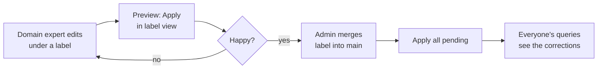

# Enrichment Review Guide

A short guide to reviewing and correcting the LLM-generated enrichment
keywords that power requirement search. One guide for both roles —
domain experts (review and correct) and admins (merge and publish);
the last section explains what happens under the hood.

## Why this exists

Every requirement is indexed with its **own words** (always searchable)
plus **enrichment keywords** an LLM added to improve recall (synonyms,
related terms, spec jargon). The LLM sometimes adds noise or misses
terms. Your corrections do two jobs:

1. **Fix search now** — remove bad keywords, add missing ones.
2. **Fix the LLM later** — your labeled, reasoned corrections are
   exported as evidence for improving the enrichment prompt, and a
   scorecard later measures whether the fix worked.

## The workflow at a glance

Your **label** (e.g. `handover-noise`) is your private branch. Nothing
you do is visible to others until an admin merges it — so edit freely.

## Domain expert: step by step

1. **Open** the Enrichment Review page. Pick MNO → Release → Plan.
2. **Fill the stamp bar**: your label and your name. Every edit is
   stamped with these — editing without a label is blocked.
3. **Edit rows**:
   - **×** on a grey chip removes an enrichment (it turns orange,
     struck through; **↺** undoes).
   - The **add box** adds one enrichment — free-form phrases are fine.
   - **Suppress all** wipes every enrichment on that requirement.
   - Set a **reason** (and optional note) per row — this is the
     evidence the prompt fix is built from. Don't skip it.
4. **Edits save instantly** to disk. There is no save button; closing
   the browser loses nothing.
5. **Preview** (optional): press the yellow *"corrections pending —
   Apply"* button. This loads *your branch* into the search service —
   only queries made with your label see it. Run your test queries,
   compare against main, iterate.
6. **Hand off**: tell the admin your label is ready to merge.
7. **After any merge** (yours or someone else's): if the yellow banner
   reappears in your view, just press it. Nothing is lost — it only
   means your branch needs a rebuild on top of the new main.

## Admin: step by step

1. Open the **Labels** drawer (the *Labels* button in the top
   toolbar). Each label shows `reqs:records` (requirements touched :
   correction records) — click through the label's rows in the table
   to review before merging.
2. **merge into main** — the label's corrections become part of
   everyone's default view *on disk*.
3. Press **Apply all pending (N releases)** — it appears at the
   bottom of the Labels drawer whenever at least one release lags,
   and disappears once everything is in sync (hover it to see which
   releases it covers). This reloads every affected release so live
   queries actually serve the merged corrections. Until this press,
   the merge exists only on disk.
4. **un-merge** retracts a label from main the same way (again followed
   by Apply all). **delete all** permanently deletes the label's
   records — the sanctioned cleanup *after* a prompt fix is confirmed
   by the scorecard, not before.

## What the indicators mean

| You see | It means |
| --- | --- |
| grey chip | enrichment from the LLM, currently active |
| orange struck chip with ↺ | removed by you (undoable) |
| green chip with ↺ | added by you (undoable) |
| faded chip, no button | in main — set by a merged label; read-only |
| `main view` / `label: X` badge | which view the table is showing |
| **●** next to a plan | that plan has corrections not yet applied to serving |
| yellow *corrections pending* banner | the open release's serving lags your view's saved edits — press to sync |
| *Apply all pending (N releases)* (bottom of the Labels drawer; only visible when something lags) | N releases across the fleet lag — one press syncs them all |
| *held — requirement changed* banner | a correction from another release didn't auto-apply here (see below); Re-affirm or Discard |

## Under the hood

**Your edits never touch the LLM's output.** Corrections are stored as
a *delta overlay*: one small JSON record per edited word — the word,
direction (remove/add), your label, reason, name, timestamp, and the
release you were viewing. The LLM's enrichment files are read-only.
Undo simply deletes the record. This is why nothing is ever lost and
why the whole history can be exported as evidence.

**Search has two layers.** The base index holds the requirement's own
words — always matchable, corrections can't break it. Enrichments are
extra keywords injected on top at load time. Removing an enrichment
only removes the *extra* match; adding one is the only way to match a
word the requirement doesn't contain.

**A label is a branch, literally.** The default ("main") view is built
from unlabeled records plus all *merged* labels. Your label's view is
main + your records, built as a separate in-memory variant in the
search service. Merging doesn't rewrite any records — it just adds
your label's name to a merge log; un-merging removes it. That's why
merge/un-merge are instant and fully reversible.

**"Pending" is a content comparison, not a guess.** The service
remembers a digest of the corrections it applied at load time. The UI
compares that against a digest of what's on disk for your view. Any
difference — a new edit, a merge, an un-merge — shows as pending; an
edit you fully undo goes back to "in sync" by itself.

**Apply = reload, nothing more.** Pressing Apply tells the search
service to re-read one release from disk and swap it in atomically.
No index rebuild, no downtime, no operator. That's also why it's safe
for anyone to press: it can only sync serving to what's already on
disk — it can never publish an unmerged label into main.

**Corrections travel across releases.** They're stored per MNO, so a
correction made in one release applies to every loaded release of that
MNO — *if* the requirement's text is still similar enough (compared in
index-word space). If the text changed too much, the correction is
**held** instead, and you decide: Re-affirm (apply here too) or
Discard. This is also why an Apply-all after one edit can count more
releases than you edited.

**The loop closes with exports.** *Review report* aggregates all
records into a label × reason matrix with top removed/added words —
the input to a prompt revision. After re-enrichment, *Prompt-fix
scorecard* checks every removed word against the new LLM output:
gone = fixed, still there = not fixed. Once a fix is confirmed, the
label's records have done their job and can be deleted.
